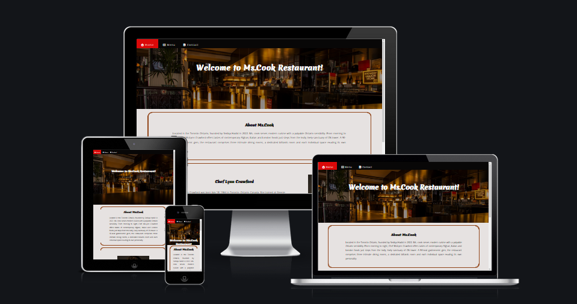
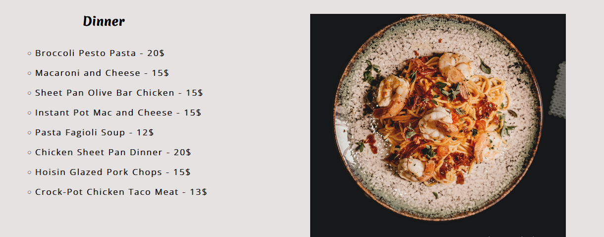
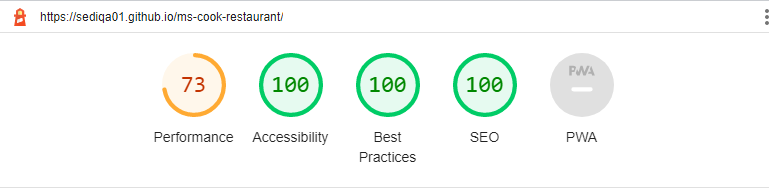

# Ms.Cook Restaurant

Ms.Cook Restaurant is a site that hopes to help people to find more information about Ms.Cook restaurant services.
The site will be targeted toward all people who are at Toronto and looking for a way to socialise and enjoiy from their letuier times with their friends, families and colleques. Ms.Cook resuraunt will be a useful way to customer to preview the restuarant servies and facilities in advance.

 # Features

 ## Existing Features

 
   ### Navigation Bar

   - Featured on all three pages, the full responsive navigation bar includes links to the  Home page, Menu page and Contact page and is identical in each page to allow for easy navigation.
   - This section will allow the user to easily navigate from page to page across all devices without having to revert back to the previous page via the ‘back’ button.

---

 ### The landing page image

   - The landing includes a photograph with text overlay to Welocome users on the page.
   - This section introduces the  Ms.Cook Restaurant to user and grab their attention with an eye catching photo and grab their attention.

---

 ### About Ms.Cook

   - The About section gives the user More information about Restaurant, founder, location and all cultural foods from other countries.
   - This section will help the Users to gain information about Restaurant.
       

---

 ### About The Chef of Restaurant

   - This section introduces the chef of restuarant to the user.
   - This section promote the restuarant reputation by presenting the chef of restuarat's fame and capability.

---

### The Footer 

   - The footer section includes links to the relevant social media sites for Ms.Cook Restaurant.
    The links will open to a new tab to allow easy navigation for the user.
   - The footer is valuable to the user as it encourages them to keep connected via social media.
    

---

 ### Menu page 

   - The footer section includes Menus for Breakfast , Lunch and Dinner .

   - The Menu page helps users to know which foods are included as well as their prices.

   - Beside each menu there are eye-catching photos attached for user enjoyment. 

 ---

 #### Breakfast Menu

 

---

 #### Lunch Menu

 

---

 #### Dinner Menu

 

---

 # Contact page

   ## Form

  - the form section contents input element for name,  input element for last name, and drop down menue for choising country, text erea for leaving a message and submit button.
  - This form allows users to share their questions, comments, feedbacks and any concern they may have with restuarant personels.

  

  

   **Open Hours** : This section helps users to scheduale their time and Breakfast ,Lunch and Dinner menue.
 
   **Address**  : This Will help user to find the exact address of restaurant with Map direction 
  
   **Contuct Number & Email** : Will encourages user to be connected through phone number or via Email.This section help user to contact the restuarant and order foods or reserve table.

   

   ---

# Features Left to Implement

I'd Like to develope this project , the feature I'll implement :\

- Ordering Foods Online
- Reservations Table Online
 

---

# Testing

- I tested that this page works in different browsers : Chrome , Firefox , Safari . 
- I confirmed that this project is responsive , looks good and functions on all standard screen sizes using the devtools device toolbar .
- I confirmed that the navigation , header , about , Menu  , and contact text are all readable and easy to understand . 
- I have confirmed that the form works : requires entries in every field and the submit button works .

---

# Validator Testing

  **HTML**
   - No errors were returned when passing through the official W3C validator.

  **CSS**
   - No errors were found when passing through the official (Jigsaw) validator.
  
   **Accessibility**
   - I confirmed that the colors and fonts chosen are easy to read and accessible by running it through lighthouse in DevTools.

   

---

 # Bugs

   ## Solved Bugs

  - When I checked  my project for W3C HTML Validator & W3C CSS Validator (Jigsaw)  I discovered , have an extra Div on my Menu page. It didn't cause any errors, but was a stray end tag.
    - I just removed that stray div tag.

  - 

  

# Deployment

The site was deployed to GitHub pages. The steps to deploy are as follows:

 - In the GitHub repository, navigate to the Settings tab.
 - From the source section drop-down menu, select the Main Branch.
 - Once the Main branch has been selected, the page will be automatically refreshed with a detailed ribbon display to indicate the successful deployment.

 The live link can be found here - (Ms.Cook Restaurant)[https://sediqa01.github.io/ms-cook-restaurant/]

---

 # Credit

   The credits section breack up into : Content and Media .

---

 ## Content
   
- The text for the Chef Information was taken from [Wikipedia Article](https://en.wikipedia.org/wiki/Lynn_Crawford)
- The text for the Breakfast Menu was taken from [Spoon Fork Bacon](https://www.spoonforkbacon.com) 
- The text for the Lunch Menu was taken from [Insanely Good Recipes](https://insanelygoodrecipes.com)  
- The text for the Dinner Menu was taken from [The Modern Proper](https://themodernproper.com) 
- The icons in the footer were taken from [Font Awesome](https://fontawesome.com/)

---
## Media

- The photos used on the home (Hero Image) and Menu page are from [Pexiel site](https://www.pexels.com/search/restaurant/)
- The images used for the Chef of Restaurant were taken from this [site](https://images.app.goo.gl/eJPuNcvyDYJ5BuBXA) 
